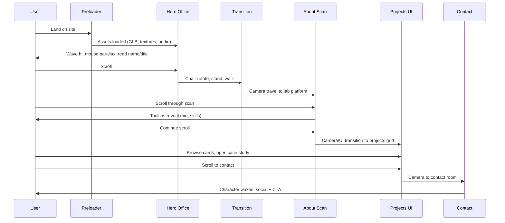

# 3D Portfolio Transition Plan — Ali Hafeez (150% Target)

**Status:** Asset choices **locked** (§18) — awaiting **“approved, start Phase 0”** to begin code  
**Reference:** [davidhckh/portfolio-2025](https://github.com/davidhckh/portfolio-2025) / david-hckh.com  
**Your screenshots:** `dh1` → `dh9` (attached May 2026)  
**Current build:** ~10% of reference (CSS sections, no continuous 3D world)  
**Your source files:** `/Me` (local only — listed in `.gitignore`, not pushed to Git)

---

## 1. Executive summary

You want a **fun, scroll-driven 3D cartoon portfolio** — not a static page with a photo. The reference site is a **single continuous experience**: one WebGL canvas, one character, camera moves through “rooms” as you scroll, with mouse parallax, animated transitions, and HTML UI layered on top.

**Target = 150% of reference** means:

| Reference (100%) | Our 150% extras |
|------------------|-----------------|
| Preloader → office hero → scan/about → projects → contact | Same core flow, plus Ali-specific easter eggs, richer sound, optional Urdu/EN toggle, WhatsApp/CV prominence, i2c demo as in-world “project portal” |
| 3D office + character animations | Custom character & room art direction (not a clone of David’s face/room) |
| Scroll + mouse camera | Same + tuned mobile fallback + performance budgets |

**This document is the blueprint only.** After you approve (and answer §12), we implement in phases with review gates.

---

## 2. Screenshot → feature mapping (your dh1–dh9)

| Screenshot | What the user sees | Must-build feature |
|------------|-------------------|-------------------|
| **dh1** | Cream screen, cube+code logo loader, faint name | **Preloader** — asset loading progress, logo animation, fade into scene |
| **dh2, dh4, dh8** | Office diorama: desk, dual monitors (code), corkboard notes, shelf, plant, rug, character at desk | **Hero / Office scene** — `room.glb` environment + rigged `avatar.glb` |
| **dh2, dh8** | Character turns head, waves “hi” | **Intro animation** — `wave` clip on load or after preloader |
| **dh2–dh8** | Mouse moves → camera shifts slightly | **Mouse parallax** — camera rig offset (±0.3–0.5 normalized) |
| **dh8** | Scroll down icon on rug | **Scroll hint** — 3D or HTML overlay, hides after first scroll |
| **Transition** (between hero & about) | Chair spins, character stands, walks to next zone | **Scroll choreography** — GSAP ScrollTrigger timeline + animation crossfade |
| **dh3, dh6, dh7** | Dark blue “lab”, character on glowing platform, hologram scan lines | **About / Scan scene** — hologram shader on body, foot→head scan progress tied to scroll |
| **dh6, dh7** | Tooltips: name, location, bio, skills list | **HTML HUD overlays** — positioned via 3D→screen projection or fixed layout per breakpoint |
| **dh9** | Cream background, “Projects” title, colorful cards grid | **Projects section** — 2D UI panel slides over or camera cuts; card grid (not 3D flip cards) |
| **dh5** | Contact: “Let’s work together”, social pills, character sleeping | **Contact scene** — `sleep` pose; on scroll-in → `wake` animation |
| **dh5** | Cardboard boxes + envelopes on floor | **Props** — delivery theme (“he delivers”) |
| **All** | Pill nav: ABOUT / PROJECTS / CONTACT + orange GET IN TOUCH + sound toggle | **Global UI chrome** — fixed header, section spy, smooth scroll to anchors |

---

## 3. The scroll story (one page, one journey)

This is the **narrative we implement** — scroll length ≈ 400–500vh total (tunable).



### Scroll zones (technical)

| Zone | Scroll % (approx) | 3D state | HTML overlay |
|------|-------------------|----------|--------------|
| Preloader | 0% (fixed until done) | Hidden or static logo | Progress % |
| Hero | 0–25% | Office camera, idle/wave | Name, “FULL STACK DEVELOPER” badge |
| Transition | 25–35% | Chair spin + stand + walk | Nav stays visible |
| About | 35–55% | Lab + hologram scan | Tooltips (staggered) |
| Projects | 55–75% | Camera pull back or scene swap | Project grid (2D) |
| Contact | 75–100% | Contact room, sleep→wake | Social + optional form |

---

## 4. Gap analysis: today vs target

| Capability | Current (v1) | Target (150%) |
|------------|--------------|---------------|
| Rendering | CSS + static image | Full-screen **Three.js** canvas |
| Character | Your PNG | Rigged **cartoon GLB** with 5+ animations |
| Environments | CSS grid background | **3 GLB scenes** (office, lab, contact) |
| Camera | None | Scroll waypoints + mouse parallax |
| Preloader | None | Logo + % loader |
| Section change | DOM sections stack | **Same canvas**, scene/camera swap |
| About skills | CSS orbit tags | **Scan shader + HUD tooltips** |
| Projects | CSS flip cards | Reference-style **large thumbnails** |
| Contact | Light form section | **3D sleep/wake** + social + boxes |
| Sound | None | Howler: hover, scroll whoosh, ambient (toggle) |
| Shaders | None | Hologram, grid floor, optional glitch transition |

**Honest estimate:** Current build ≈ **10%** of reference fidelity. Reaching **100%** is a multi-week 3D project; **150%** adds polish passes and Ali-specific content.

---

## 5. What we remove (approved in plan)

| Remove | Reason |
|--------|--------|
| `MAS_5458-nbg1.png` in hero | Replaced by 3D character |
| `components/portfolio/sections/Hero.jsx` photo layout | Replaced by canvas + HTML overlay |
| CSS-only “hologram” on photo | Real shader on mesh |
| CSS 3D flip project cards | Reference uses flat grid cards |
| Dark radial-gradient-only aesthetic for hero | Cream office per reference |
| `BackgroundGrid.jsx` | Replaced by 3D floor/grid shader |

**Keep & reuse:**

| Keep | Reuse how |
|------|-----------|
| `content/profile.js`, `content/projects.js` | **Populate from `/Me`** (see §16) for tooltips & project cards |
| `pages/api/contact.js`, `lib/contactValidation.js` | Wire to contact UI overlay |
| `hooks/useLenis.js` (extend) | Scroll sync with ScrollTrigger |
| Footer CV + WhatsApp URLs | “Get in touch” + footer |
| `/portfolio/i2c-assessment` route | Linked from a project card |
| Next.js 13 + `jsconfig` paths | Stay on Pages router (or plan App Router migration separately) |

---

## 6. Technical architecture (Next.js port of reference)

Reference stack: **Vue 3 + Vite + three.js + GSAP + Lenis + Howler + GLSL**.

**Our stack (proposed):**

| Layer | Choice | Notes |
|-------|--------|-------|
| Framework | **Next.js 14** (upgrade from 13.4) | Better dynamic import, `next/dynamic` for canvas |
| 3D | **Three.js r16x** + **@react-three/fiber** + **@react-three/drei** | Faster iteration than raw Three; optional pure Three if you prefer |
| Scroll | **GSAP ScrollTrigger** + **Lenis** | Pin sections, scrub camera timelines |
| Loaders | **DRACOLoader** + `useGLTF` | Compress GLBs (<2MB each target) |
| Shaders | **glslify** or inline `shaderMaterial` | Hologram scan, grid floor |
| Audio | **howler** | Mute toggle in header (dh2) |
| State | **Zustand** (light) | `section`, `audioEnabled`, `loadProgress` |
| UI | React overlays (fixed) | Nav, tooltips, project modal |
| Deploy | Vercel | WebGL + API route supported |

### High-level file structure (new)

```
components/
  experience/
    ExperienceCanvas.jsx      # dynamic import, ssr: false
    Preloader.jsx
    UIChrome.jsx              # nav, get in touch, sound
    overlays/
      HeroOverlay.jsx
      AboutTooltips.jsx
      ProjectsPanel.jsx
      ContactPanel.jsx
lib/
  three/
    ExperienceManager.js      # scene, renderer, resize
    CameraRig.js              # parallax + waypoints
    loaders.js
    shaders/
      hologram.glsl
      gridFloor.glsl
    scenes/
      OfficeScene.js
      LabScene.js
      ContactScene.js
    objects/
      Avatar.js               # animations: idle, wave, stand, walk, sleep, wake
hooks/
  useExperience.js
  useScrollTimeline.js
public/
  models/                     # GLB (Draco)
  textures/
  sounds/
  videos/                     # optional project previews
content/
  profile.js
  projects.js
pages/
  index.js                    # <Experience /> only
  api/contact.js
```

### Single-canvas rule

Unlike the current stacked `<section>` layout, the **3D view stays mounted** for the whole visit. HTML panels fade/slide in per scroll zone. This matches david-hckh.com and avoids WebGL context churn.

---

## 7. 3D assets — free & low-cost options (no commission required)

Reference repo **does not ship GLB files** in GitHub; models are custom/proprietary. We **cannot legally copy** David’s character or room meshes.

**Good news:** We can reach ~90–100% of the reference look using **free, legal sources** — then polish in Blender (scale, materials, combine into one GLB per scene).

### Locked choices (Ali — approved)

| Role | Asset | Link |
|------|--------|------|
| **Character** | **Adam** (Mixamo) | [Mixamo Characters](https://www.mixamo.com/#/?page=2&query=&type=Character) |
| **Hero office (primary)** | **Tiny Office** — Studio Ochi | [Sketchfab: Tiny Office](https://sketchfab.com/3d-models/tiny-office-f06968dcfd7a48a3a868c5007fa246d9) |
| **Hero office (alt A)** | Home Office Asset Pack — Joel Benji | [Sketchfab preview](https://sketchfab.com/3d-models/home-office-asset-pack-preview-e0f1afe9d712461da212f709054709fc) — **paid pack**, not free |
| **Hero / contact (alt B)** | Artist’s Home office / Study — Mila Andrushchenko | [Sketchfab: isometric room](https://sketchfab.com/3d-models/isometric-room-artists-home-office-roomstudy-67ec2f52c45a4b5f95690c04887e31b0) — includes **couch + mattress** for rest/sleep |
| **Contact floor props** | CD, cassette, **envelopes**, **parcels** | [Poly Pizza](https://poly.pizza) (CC0) |

**Implementation recommendation**

| Scene | Model strategy |
|-------|----------------|
| **Hero (dh2, dh8)** | **Tiny Office** GLB + **Adam** at desk; wave → idle |
| **Contact (dh5)** | **Poly Pizza** envelopes + parcels + CD + cassette on floor; **Adam** `Sleeping` → `Wake` animation; optional: place sleep near **couch/mattress** from isometric room (alt B) if we import that GLB or extract those meshes in Blender |
| **About lab** | Procedural platform + hologram shader (no new Sketchfab required) |

If **Tiny Office** download/license is blocked, fall back to **isometric room (alt B)** for the whole office (desk + couch in one scene).

**Not selected for v1:** Joel Benji Home Office pack unless you purchase it ([seller link on model page](https://sketchfab.com/3d-models/home-office-asset-pack-preview-e0f1afe9d712461da212f709054709fc)).

**Pipeline:** Mixamo FBX (Adam) → Blender → `avatar.glb` · Sketchfab GLB → decimate/merge → `office.glb` · Poly Pizza → `contact-props.glb`

**License rule:** Confirm **Download** button + license on each Sketchfab page before use. Log everything in `public/models/ATTRIBUTION.md`. Mixamo = [Adobe terms](https://www.adobe.com/legal/terms.html).

---

### All options (you can pick or mix)

| ID | Option | Cost | Best for | Caveat |
|----|--------|------|----------|--------|
| **E1** | **Mixamo** (recommended) | Free | Wave, walk, sleep, idle | Not unique; many sites use same rigs |
| **E2** | **Sketchfab CC0/CC-BY** | Free | Office room, furniture | Must check license per model |
| **E3** | **Kenney / Poly Pizza** | Free (CC0) | Boxes, props, simple rooms | Less “premium cartoon” than reference |
| **E4** | **Quaternius** packs | Free (CC0) | Stylized low-poly character + furniture | Fewer animation clips |
| **E5** | **Ready Player Me** | Free tier | Quick cartoon avatar GLB | Less control over “office guy at desk” pose |
| **E6** | **Spline** community scenes | Free–paid | Prototype whole office fast | Export + optimization can be fiddly |
| **E7** | **Google Poly Pizza / similar aggregators** | Free | Search “office desk GLB” | Verify license each time |
| **A** | Commission custom (Fiverr/Blender) | $200–800+ | Truly unique “Ali” mascot | Only if free stack feels too generic later |
| **D** | Code placeholders (boxes + capsule) | $0 | Start Phase 0–1 same day | Replace before public launch |

**Removed as default:** “you must commission” — that was the expensive path, not the only path.

### Minimum asset list

| Asset | Animations | Size target |
|-------|------------|-------------|
| `avatar.glb` | idle, wave, sit_to_stand, walk, sleep, wake | < 1.5 MB Draco |
| `office.glb` | — (static) | < 2 MB |
| `lab.glb` | platform emissive | < 1 MB |
| `contact-props.glb` | envelopes, parcels, CD, cassette (Poly Pizza) | < 1 MB |
| `contact-room.glb` (optional) | couch/mattress from isometric room | < 1.5 MB |
| Project thumbnails | — | WebP, 800px wide |

**Art direction for Ali (not David clone):**

- Cream / warm office (dh2) — keep
- Character: **Mixamo “Adam”**; optional material tint in Blender — **not** a clone of David’s character
- Accent color: **amber/gold** (`#FFD166` from Design Upgrade) — distinct from reference orange
- Name: **Ali Hafeez** / title: **Full Stack Developer | Cyber Security Enthusiast** (from your CV)
- Business card (`Me/Ali - Buisness Card.png`): optional reference for **logo / accent colors only** — not used as 3D texture unless you ask

---

## 16. Your content — `/Me` folder (source of truth)

The `/Me` directory is **gitignored** (private résumé data stays on your machine). At implementation time we **copy distilled facts** into `content/profile.js` and `content/projects.js` (those *are* committed).

### Files reviewed

| File | Use in portfolio |
|------|------------------|
| `Ali Hafeez - Complete Professional Journey.md` | Master bullets — bio, timeline, skills |
| `Ali Hafeez - Detailed CV.md` | Contact links, job titles, tech stack |
| `Professional Projects - Detailed Documentation.md` | Project cards (titles, URLs, stacks) |
| `Professional Journey.md` | Shorter duplicate of journey — cross-check |
| `MS Cyber Security…`, `BS FYP…`, `BS Projects…` | Deep case studies (modal / future subpages) |
| `MS Thesis - DoS in LoRaWAN…` | Featured research project card |
| `Ali - Buisness Card.png` | Branding reference only (optional) |

### Identity (for overlays & tooltips)

| Field | Value (from your docs) |
|-------|-------------------------|
| Name | Ali Hafeez |
| Title | Full-Stack Developer \| Frontend Engineer \| Cyber Security Enthusiast |
| Location | Kahuta, Punjab, **Pakistan** |
| Experience | 9+ years in tech · 5+ years professional · 7+ years React/Angular |
| Email | alihafeez337@gmail.com |
| Phone / WhatsApp | +92 304 873 7860 |
| Website | alihafeez.com |
| LinkedIn | linkedin.com/in/**alihafeez337** |
| GitHub | github.com/**alihafeez337** |
| CodePen | codepen.io/Ali_Hafeez |
| Upwork | 100% Job Success Rate |

### One-line bio (scan tooltip — dh6)

> Full-stack developer with a security-first mindset (MS Cyber Security, PIEAS). I build maintainable React/Next.js products, real-time systems, and bilingual apps — from creative platforms to healthcare and IoT research.

### Skills list (scan tooltip — dh7)

Prioritize what matches **you** (not David’s list):

- React / Next.js / TypeScript  
- Vue / Angular  
- Node.js / Express / gRPC  
- Three.js / WebGL / D3.js  
- Flutter  
- PostgreSQL / MySQL / MongoDB  
- Docker / AWS  
- WebSockets / real-time  
- Cyber Security / LoRaWAN (research)  
- i18n / RTL (EN + Arabic)

### Projects for v1 grid (dh9) — proposed 6 cards

| # | Project | Why show it | Link |
|---|---------|-------------|------|
| 1 | **HI-Creative / Hamah Tools** | Current role, React 19, AI, RTL | hamah-tools.hi-lab.ai |
| 2 | **Healthcare Assessment Platform** | Full-stack, multi-tenant | app.thrivenine.life |
| 3 | **Flowtack Web Builder** | Long-running product, GrapesJS | app.flowtrack.co |
| 4 | **Airvi / Digital Twin** | Flutter + gRPC + simulation | (case study / demo) |
| 5 | **DoS in LoRaWAN (MS Thesis)** | Cyber + research depth | GitHub lorawan repos |
| 6 | **i2c Figma → HTML** | Already in repo | `/portfolio/i2c-assessment` |

*You can swap any card before Phase 4 — e.g. Baytut 3D e-commerce, Fleet Management D3.*

### CV & CTA

- Keep existing Google Drive CV link from layout (or update from CV doc if you have a newer link).  
- **GET IN TOUCH** → WhatsApp `wa.me/923048737860` or email.  
- Optional: Upwork badge in contact section (“100% Job Success”).

### What we do **not** put in the public repo

- Full `/Me` markdown (stays local).  
- Business card image (unless you explicitly want it in `public/`).  
- Client credentials / staging passwords mentioned in project docs.

---

## 8. Implementation phases (with approval gates)

### Phase 0 — Foundation (2–3 days)
**Gate 0:** You approve this plan (asset default: **E1 Mixamo + E2 Sketchfab CC0**).

- Upgrade Next.js, install Three/R3F/drei/gsap/howler/zustand
- `ExperienceCanvas` blank scene + resize + rAF loop
- Preloader shell (dh1) with fake progress → real loader later
- Remove photo hero from index

**Deliverable:** Black/cream canvas loads, preloader works, no broken layout.

---

### Phase 1 — Hero office (5–7 days)
**Gate 1:** Office + character feels “alive”.

- Load `office.glb` + `avatar.glb` (placeholder OK)
- Lighting (ambient + directional + desk area light)
- Camera default pose (match dh2 framing)
- Mouse parallax on camera rig
- Play `wave` then `idle` on entry
- HTML: name + title badge + nav pills + GET IN TOUCH
- Scroll hint on rug

**Deliverable:** dh2/dh8 parity for hero; mouse move shifts camera.

---

### Phase 2 — Scroll transitions (4–6 days)
**Gate 2:** Scroll from hero → about feels cinematic.

- Lenis + ScrollTrigger scrub timeline
- Chair rotate animation (or proxy empty pivot)
- `sit_to_stand` + short `walk` / camera dolly to lab
- Scene blend: office → lab (crossfade or single scene with hidden groups)
- Section spy updates nav highlight

**Deliverable:** User scrolls once through hero→about without breaks.

---

### Phase 3 — About / scan (5–7 days)
**Gate 3:** dh6/dh7 tooltip experience.

- Lab environment + glowing platform
- Hologram shader (foot→head driven by scroll progress 0→1)
- HTML tooltips: name, location (**Kahuta, Pakistan**), bio, skills from `content/profile.js` (sourced from `/Me`)
- Connector lines (SVG or CSS) from tooltip to character anchor points

**Deliverable:** Scan + skills readable; scroll scrubs effect.

---

### Phase 4 — Projects (3–4 days)
**Gate 4:** dh9 grid.

- Camera transition or full-screen HTML panel (cream bg)
- Project cards from `content/projects.js`
- Click → modal or `/portfolio/[slug]` for i2c
- Optional: project preview video in modal

**Deliverable:** Projects section matches reference layout.

---

### Phase 5 — Contact + wake (4–5 days)
**Gate 5:** dh5 parity.

- Contact scene: character `sleep` loop
- On enter viewport: `wake` once
- Boxes + envelopes props
- Social icons (GitHub, LinkedIn, WhatsApp, Email)
- Reuse `/api/contact` behind “Send message” drawer (optional)

**Deliverable:** Contact emotional beat works on scroll-in.

---

### Phase 6 — 150% polish (5–8 days)
**Gate 6:** Ship candidate.

- Sound design (toggle, hover clicks, section whoosh)
- Interactive props: corkboard notes, penguin click (from Design Upgrade)
- Easter egg: Konami or desk object → secret message
- Mobile: reduced particles, simpler shaders, static camera fallback
- Performance pass: Draco, lazy load lab/contact GLBs
- Lighthouse + 30fps mobile test

**Deliverable:** Production deploy on Vercel.

---

### Total rough timeline

| Scope | Calendar time (1 dev) |
|-------|----------------------|
| 100% reference parity | **4–6 weeks** |
| + 150% polish | **+1–2 weeks** |
| Free assets (Mixamo + CC0) | Usually **0 extra wait** — download in parallel with Phase 0–1 |
| Custom commission (optional v1.1) | **+1–3 weeks** if you upgrade from Mixamo later |

---

## 9. “150%” feature backlog (after 100% works)

Pick which extras you want in v1 vs v1.1:

| Feature | Priority suggestion |
|---------|---------------------|
| Ambient office sound + UI SFX | v1 |
| Desk objects clickable (penguin, speaker) | v1 |
| WhatsApp floating CTA (your link) | v1 |
| CV opens in new tab from nav | v1 |
| Urdu / English copy toggle | v1.1 |
| Project case study subpages with same 3D chrome | v1.1 |
| Blog / notes on corkboard in 3D | v2 |
| WebGL fallback image sequence for old devices | v1 |

---

## 10. Performance & production safety

| Rule | Target |
|------|--------|
| Total GLB (initial) | Office + avatar only; lab/contact lazy |
| Desktop FPS | 60 |
| Mobile FPS | 30 (reduce shadows, disable parallax) |
| First interaction | < 4s on 4G after preloader |
| `prefers-reduced-motion` | Skip walk/scan; jump sections |
| SEO | `next/head` meta, semantic overlays, `noscript` fallback paragraph |
| API | Keep validated contact route |

---

## 11. Success metrics (updated for 3D)

| ID | Workflow | Pass criteria |
|----|----------|---------------|
| M1 | Preloader | Logo → scene, no flash of unstyled content |
| M2 | Hero wave | Wave plays within 2s of load |
| M3 | Mouse parallax | Camera moves with cursor (desktop) |
| M4 | Scroll hero→about | Chair/stand/walk or equivalent without pop |
| M5 | Scan | Shader progress tied to scroll |
| M6 | Tooltips | Bio + skills match `/Me` → `content/profile.js` |
| M7 | Projects | Grid + open i2c project |
| M8 | Contact wake | Sleep → wake on scroll into section |
| M9 | Sound toggle | Mute persists for session |
| M10 | Mobile fallback | Usable layout, no crash |
| M11 | Build | `npm run build` green |

---

## 12. Decisions needed from you (short checklist)

**Already locked:** Adam + Tiny Office + Poly Pizza contact props (§18). Confirm the rest, then reply **“approved, start Phase 0”**.

```
[ ] I approve this plan overall: YES / NO / CHANGES: ___

3D assets: LOCKED — Adam (Mixamo) + Tiny Office + Poly Pizza (§18)
  [ ] OK to use isometric room (alt B) for couch/mattress in contact: YES / NO
  [ ] I purchased Joel Benji office pack — use it: YES / NO (default NO)

Character: Adam (Mixamo) — OK? YES / NO

Accent color: Amber #FFD166 (default) / Reference orange / Other: ___

Title badge: "FULL STACK DEVELOPER" / Full title from CV / Other: ___

Location tooltip: Kahuta, Punjab, Pakistan (default) / Other: ___

Projects v1: Use §16 table (6 cards) / Edit list: ___

Contact: Form + social (default) / Social only

Sound default: OFF (user opts in) / ON

Next.js 14 upgrade: YES (recommended) / NO

Timeline: ~5–7 weeks to v1 (default) / ___ weeks

Start: Phase 0 after your OK
```

---

## 13. Risk register

| Risk | Mitigation |
|------|------------|
| No GLB assets | Mixamo + CC0 downloads in parallel with Phase 0–1; placeholders only if downloads delayed |
| Mixamo looks generic | Materials + office art direction; optional commission (A) in v1.1 |
| Bundle too heavy | Draco + route-level dynamic import canvas |
| Scroll jank | One ScrollTrigger timeline; Lenis integration tested early |
| Mobile WebGL poor | `drei` performance monitor; fallback 2D scroll site |
| Scope creep (150%) | Freeze v1 at Phase 5 gate; polish is Phase 6 only |
| Copyright | Never use David’s meshes/audio; inspired-by only |

---

## 14. Relationship to existing docs

| Document | Role after 3D build |
|----------|---------------------|
| `Design Upgrade.md` | Shader/camera specs — **still valid** |
| `User Journey.md` | **Rewrite** after Phase 5 |
| `Success Metrics.md` | **Replace** with §11 above |
| `Implementation Report.md` | **New report** per phase gate |
| `/Me/*` | **Private** — never committed; feeds `content/*.js` |

---

## 15. Recommended approval path

1. **You review this doc** → confirm §12 (defaults are fine to accept as-is).  
2. **Asset track:** Download **Adam** + animations; **Tiny Office** GLB; Poly Pizza props (§18 checklist).  
3. **Phase 0–1 build** → you test hero in browser vs dh2/dh8.  
4. **Iterate phases 2–6** with screenshot comparisons to dh1–dh9.  
5. **Final QA report** + deploy guide.

---

## 17. Mixamo **Adam** — animation download list

Apply each animation to the **Adam** character on [Mixamo](https://www.mixamo.com), download **FBX for Unity** (or **FBX**), 30 fps, **without skin** only once on first clip then **with skin** per their workflow.

| Order | Mixamo search term | Used in |
|-------|-------------------|---------|
| 1 | `Waving` | Hero intro (dh2, dh8) |
| 2 | `Sitting` or `Typing` | Seated at desk idle |
| 3 | `Idle` | Standing / general |
| 4 | `Standing Up` | Scroll transition — leave chair |
| 5 | `Walking` | Move toward lab zone |
| 6 | `Sleeping` | Contact — asleep (dh5) |
| 7 | `Getting Up` or `Wake` / `Stand Up` | Contact — wakes when section enters |

Merge in Blender → single `avatar.glb` with named actions: `wave`, `sit_idle`, `idle`, `stand_up`, `walk`, `sleep`, `wake`.

---

## 18. Asset download checklist (before Phase 1)

### Character — Adam

1. Log in to [Mixamo](https://www.mixamo.com/#/?page=2&query=&type=Character).
2. Select **Adam**.
3. Download animations from §17.
4. Export merged `public/models/avatar.glb` (Draco).

### Office — Tiny Office (primary)

1. Open [Tiny Office by Studio Ochi](https://sketchfab.com/3d-models/tiny-office-f06968dcfd7a48a3a868c5007fa246d9).
2. Confirm license allows download (CC / CC-BY / Standard — note in ATTRIBUTION).
3. Download **glTF/GLB**, place as `public/models/office.glb`.
4. In Blender: scale to ~1.7m door height, origin at floor, reduce tris if >300k hurts mobile.

### Office — Isometric room (fallback + couch)

1. Open [Artist’s Home office / Study](https://sketchfab.com/3d-models/isometric-room-artists-home-office-roomstudy-67ec2f52c45a4b5f95690c04887e31b0).
2. Use if Tiny Office fails **or** export couch/mattress mesh for contact scene.
3. Save as `office-isometric.glb` or `contact-room.glb`.

### Contact props — Poly Pizza

Search and download CC0 GLBs (names may vary slightly):

| Prop | Poly Pizza search | File name (example) |
|------|-------------------|---------------------|
| Envelopes | `envelope` | `envelope.glb` |
| Parcels / boxes | `parcel` / `package` / `cardboard box` | `parcel.glb` |
| CD | `cd` / `compact disc` | `cd.glb` |
| Cassette | `cassette` | `cassette.glb` |

Combine in Blender → `public/models/contact-props.glb` or load separately in Three.js.

### Do not use without purchase

- [Home Office Asset Pack (Preview)](https://sketchfab.com/3d-models/home-office-asset-pack-preview-e0f1afe9d712461da212f709054709fc) — seller states **available to purchase** on Linktree; preview alone is not a free production license.

### Attribution file

Create `public/models/ATTRIBUTION.md`:

```markdown
- Character: Adobe Mixamo — Adam — https://www.mixamo.com
- Office: Studio Ochi — Tiny Office — https://sketchfab.com/3d-models/tiny-office-f06968dcfd7a48a3a868c5007fa246d9
- Contact props: Poly Pizza — (list each model URL)
- Optional room: Mila Andrushchenko — (URL if used)
```

---

*Implementation starts after you reply **“approved, start Phase 0”** (or note edits to §12).*
