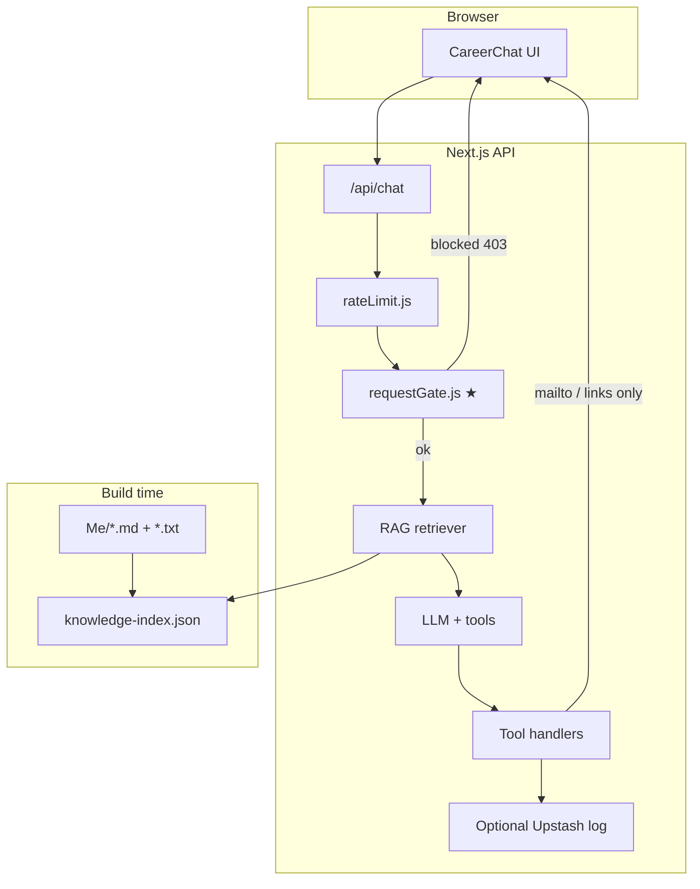

# Career Chatbot — Implementation Plan

**Project:** Ali Hafeez Portfolio — interactive “Hi, I am Ali” chat  
**Status:** Plan only (awaiting your approval before coding)  
**Based on:** `Sample/4_lab4.ipynb` (tool-use pattern) + `Me/` knowledge base  
**Last updated:** May 19, 2026 (revision 2 — your feedback applied)

---

## 1. Executive summary

You want a **right-side chat panel** on your existing single-page portfolio (photo left, chat right) where **Ali speaks in first person** (“Hi, I am Ali. Ask me anything”), answers questions **only about you** using RAG over your docs, and stays **secure and cheap**—no Pushover, no Hugging Face, **no outbound emails to you** unless the visitor explicitly wants to email you.

A dedicated **`requestGate` security module runs before every LLM call**: short messages only, blocks code/regex-style input and off-topic questions, then rate limits. Unknown answers are handled **in the chat** (with contact CTAs if the user keeps insisting)—not emailed to you.

Hosting stays on **Next.js + Vercel**. LLM: **Gemini (free tier)** primary, **Groq** backup.

---

## 2. What you have today

### 2.1 Web app (current)

| Item | Detail |
|------|--------|
| Framework | Next.js **13.4.9** (Pages Router) |
| Home page | Single centered photo (`MAS_5458-nbg1.png`, ~80vh) |
| Layout | `Main_Layout.js` — header, footer, dark radial gradient |
| Contact links | CV (Google Drive), WhatsApp [`wa.me/+923125925295`](https://wa.me/+923125925295) (“Let’s be friends”) |
| Dependencies | Minimal: `next`, `react` only |

**Note:** `alihafeez.com` is **no longer used** anywhere in this project (removed from prompts, copy, and config).

### 2.2 Knowledge base (`Me/` folder)

**Markdown (8 files)** — ~206K characters, plus **3 new text files** (recommendation letters):

| File | Role |
|------|------|
| `Ali Hafeez - Complete Professional Journey.md` | Canonical master reference (**index this**) |
| `Professional Journey.md` | Duplicate of above — **skip in RAG index** |
| `Ali Hafeez - Detailed CV.md` | CV-style summary |
| `Professional Projects - Detailed Documentation.md` | **Includes GrapesJS open-source work and SUMO / Digital Twin (AIRVI)** in depth |
| `BS FYP - Detailed Technical Documentation.md` | Final year project |
| `BS Projects - Detailed Documentation.md` | Undergraduate projects |
| `MS Cyber Security - Detailed Documentation.md` | MS coursework |
| `MS Thesis - DoS in LoRaWAN - Complete Documentation.md` | Thesis |
| `AI genrated recommendation letter by Dr. Tauseef Jamal.txt` | Supervisor recommendation (general) |
| `AI genrated recommendation letter by Dr. Tauseef Jamal - (Tailored for CDT-FORT).txt` | Tailored recommendation |
| `AI genrated recommendation letter by Dr. Hanif Durad.txt` | Additional recommendation |

One PNG business card (not used for RAG).

**GrapesJS & SUMO coverage:** Your docs already contain substantial material—e.g. GrapesJS contribution and Flowtack in `Professional Projects`, SUMO integration under AIRVI / Digital Twin Simulator (OSM → netconvert, simulation loop, visualization). No extra ingest work required unless you add more write-ups later. If retrieval ever misses them, suggested prompt chips (“GrapesJS contribution?”, “SUMO / traffic simulator?”) can help in Phase 3.

### 2.3 External links to integrate in chat

| Purpose | URL |
|---------|-----|
| Free consultation | [https://koalendar.com/u/ali-hafeez](https://koalendar.com/u/ali-hafeez) |
| WhatsApp | [https://wa.me/+923125925295](https://wa.me/+923125925295) |
| Email (visitor-initiated only) | `mailto:alihafeez337@gmail.com` |
| CV (footer) | Google Drive PDF (unchanged) |

### 2.4 Sample lab — what we keep vs change

| Lab pattern | Keep? | Our approach |
|-------------|-------|--------------|
| OpenAI tool calling loop | ✅ | Same loop in `/api/chat` |
| `record_user_details` | ❌ as email | Replaced by in-chat contact steering + optional `mailto` |
| `record_unknown_question` | ❌ as email | In-chat “I don’t have that” + contact CTAs |
| Pushover / Resend to you | ❌ | **No proactive emails to you** |
| Full doc in system prompt | ❌ | **RAG** |
| Gradio UI | ❌ | Custom React panel |
| Hugging Face deploy | ❌ | Vercel with your Next.js app |

---

## 3. Goals and non-goals

### 3.1 Goals

1. **65/35 desktop split:** photo left, chat right.
2. **First-person Ali persona:** opening line **“Hi, I am Ali. Ask me anything.”** (not “Ask Ali”).
3. **Mobile:** floating **AI-style chat icon** (bottom corner) → instant-message sheet; feels like IM.
4. **RAG** over `Me/*.{md,txt}` (excluding duplicate Journey file).
5. **Security gate before API/LLM** — mandatory module (§9).
6. **Tools:** consultation, WhatsApp, visitor-initiated email (`mailto`), security flag, contact steering when user persists.
7. **Gemini free tier** + **Groq** backup; no paid notification services.

### 3.2 Non-goals (phase 1)

- Emailing you on every unknown question or lead
- Pushover, Resend, Formspree as default notification path
- `alihafeez.com` branding
- User accounts or stored chat history in a DB
- Hugging Face deployment

---

## 4. UI / layout plan

### 4.1 Desktop (65% / 35%)

```
┌──────────────────────────────────────────────────────────────────┐
│  HEADER: Ali Hafeez - The Programmer                    (sticky) │
├───────────────────────────────┬──────────────────────────────────┤
│                               │  ● Ali  (online-style indicator) │
│      [Your photo]             │  ─────────────────────────────   │
│      centered, ~70vh          │  Ali: Hi, I am Ali. Ask me       │
│                               │       anything.                  │
│                               │  [message list, scrollable]      │
│                               │                                  │
│                               │  [Book consultation] [WhatsApp]  │
│                               │  [ input (short)      ] [Send]   │
├───────────────────────────────┴──────────────────────────────────┤
│  FOOTER: View my CV  and  Let's be friends (WhatsApp)            │
└──────────────────────────────────────────────────────────────────┘
```

- Chat opens **already showing** the welcome message (interactive from first paint).
- Input placeholder e.g. “Ask me about my work, projects, or background…”
- Subtle **typing indicator** while waiting for API (IM feel).

### 4.2 Mobile — floating AI chat icon (confirmed)

- Full-screen photo preserved.
- **Fixed FAB** bottom-right: chat bubble icon + small “AI” or pulse dot (like messenger apps).
- Tap → **bottom sheet** (~85vh) with same chat UI, drag handle, blur backdrop.
- Label optional on long-press: “Ask me anything”.
- Does **not** use stacked layout by default.

### 4.3 Visual design

- Match `Main_Layout` dark gradient + glassmorphism (`backdrop-filter: blur(24px)`).
- Roboto Mono for chat UI; optional soft accent `#FFD166` from Design Upgrade doc.
- User bubbles right-aligned; “Ali” bubbles left with small avatar or initial **A**.

### 4.4 Component structure (planned)

```
components/
  chat/
    CareerChat.js
    CareerChat.module.css
    ChatMessageList.js
    ChatInput.js
    QuickActions.js
    ChatFab.js              # Mobile only
    ChatBottomSheet.js      # Mobile only
pages/
  api/
    chat.js
lib/
  rag/
    chunker.js
    embedder.js
    retriever.js
  agent/
    tools.js
    systemPrompt.js
    handleToolCalls.js
  security/
    requestGate.js          # ★ Runs BEFORE LLM — required
    rateLimit.js
    patterns.js             # Regex / code / injection rules
data/
  knowledge-index.json
```

---

## 5. Architecture overview



**Request flow (strict order)**

1. `POST /api/chat` with `message` + `history`.
2. **Rate limit** (Upstash per IP).
3. **`requestGate` security module** — if fail → `403` + canned reply, **no LLM call** (saves cost and abuse).
4. RAG retrieve top K chunks.
5. LLM + tools loop.
6. Return reply (+ optional `sources`).

---

## 6. RAG design

(Unchanged core; ingest expanded.)

### 6.1 Ingest sources

- All `Me/*.md` except `Professional Journey.md` (duplicate).
- All `Me/*.txt` (three recommendation letters).
- Chunk `.txt` files with same header/size rules as markdown.

### 6.2 Chunking

| Setting | Value |
|---------|--------|
| Split on | Markdown `##` / `###`; paragraph boundaries for `.txt` |
| Target chunk size | 400–600 tokens |
| Overlap | 80–120 tokens |
| Metadata | `source_file`, `section_title`, `chunk_id` |

### 6.3 Embeddings

**Gemini embedding API** (free tier with your Gemini key) at build time via `npm run build:index`.

### 6.4 Low-confidence answers (no email)

If similarity below threshold:

- Ali replies in character: e.g. “I don’t have that detail in my notes. You can ask about my projects, MS thesis, GrapesJS work, or SUMO traffic simulations—or reach me directly.”
- If user **insists** or repeats → call `suggest_contact_options` (WhatsApp, Koalendar, mailto)—still **no email to you**.

---

## 7. LLM providers

### 7.1 Primary: **Google Gemini (free tier)**

- Use current free models via [Google AI Studio](https://aistudio.google.com/) (e.g. Gemini Flash / latest free small-usage tier—**not tied to “2.0” naming**; pick whatever is free at implementation time).
- Tool/function calling + embeddings with one key.

### 7.2 Backup: **Groq**

- Free tier for dev/failover ([Groq Console](https://console.groq.com/)).
- Env: `LLM_PROVIDER=gemini|groq`.

### 7.3 Optional later: DeepSeek

- Only if you exceed free quotas; not required for launch.

**Default:** `gemini` with automatic fallback to `groq` on rate-limit errors (optional).

---

## 8. Agent tools (revised — no proactive email)

### 8.1 Tool list

| Tool | When used | Action |
|------|-----------|--------|
| `offer_free_consultation` | Meet, consult, interview, hire | Return [Koalendar](https://koalendar.com/u/ali-hafeez) link |
| `connect_whatsapp` | Quick chat, “message you” | Return `https://wa.me/+923125925295` |
| `open_email_to_ali` | User **explicitly** asks to email you / send you a message | Return **`mailto:`** link with prefilled subject/body for **visitor’s** mail client — **you are not emailed by the server** |
| `suggest_contact_options` | Unknown answer, user persists, or wants human follow-up | Offer WhatsApp + Koalendar + optional mailto (discourage spam; one clear CTA) |
| `flag_security_concern` | Abuse, jailbreak, repeated off-topic | **Server log only** (Upstash list, throttled)—no email |

**Removed from lab:**

- `record_unknown_question` → no backend email
- `record_user_details` → no backend email; if they want contact, steer to WhatsApp/Koalendar/mailto

### 8.2 Persona (system prompt outline)

- You **are Ali Hafeez** speaking in **first person** on your portfolio site.
- Opening behavior is already in UI; stay in character.
- Answer only from **retrieved context**; never invent employers, dates, or projects.
- If unsure: say so honestly; use `suggest_contact_options` only if they keep pushing.
- **Only** use `open_email_to_ali` when the user clearly wants **to send you an email** (not for every lead).
- Steer warm leads to **Koalendar** or **WhatsApp** before email.
- Off-topic: brief refusal (§9.3).
- **Do not** mention `alihafeez.com`.

### 8.3 Contact policy (your preference)

| Situation | Behavior |
|-----------|----------|
| Normal Q&A | Answer from RAG only |
| Don’t know | In-chat apology + what you *can* talk about |
| User insists | `suggest_contact_options` |
| User says “email Ali about X” | `open_email_to_ali` → mailto (they send it) |
| User shares their email in chat | Acknowledge in chat only; **do not** notify you by email |

---

## 9. Security plan — `requestGate` module (before LLM)

This module is **required in MVP**, not a later phase.

### 9.1 File: `lib/security/requestGate.js`

Exported function: `validateChatRequest({ message, history })` → `{ ok: true }` or `{ ok: false, code, userMessage }`.

Runs **after** rate limit, **before** RAG/LLM.

### 9.2 Hard limits (small questionnaire only)

| Rule | Value |
|------|--------|
| Max message length | **280** characters (tweet-scale) |
| Min length | **2** characters (after trim) |
| Max history turns | **10** pairs (20 messages) |
| Max total history chars | **4,000** |
| Max messages per session/minute | Rate limiter (§9.6) |

### 9.3 Blocked content (regex / heuristics — `lib/security/patterns.js`)

Reject with `403` and a friendly line (no LLM):

| Category | Examples blocked |
|----------|------------------|
| **Code dumps** | Triple backticks, `function(`, `import `, `<?php`, `#include`, `SELECT * FROM` |
| **Regex / shell** | Long regex literals, `curl \|`, `wget`, `eval(`, `exec(` |
| **Script injection** | `<script`, `javascript:`, `onerror=` |
| **Prompt injection** | “ignore previous instructions”, “you are now DAN”, “system prompt” |
| **Excessive structure** | >30% non-letter symbols, >5 URLs, >10 repeated chars |
| **Off-topic (fast heuristic)** | No overlap with allowlist keywords (Ali, Hafeez, career, project, thesis, LoRaWAN, GrapesJS, SUMO, PIEAS, React, etc.) **and** message matches off-topic patterns (weather, homework, “write code for”, other celebrities, etc.) |

Optional **light embedding check** (phase 1.5): compare message to “about Ali” vs “generic chat” centroids—only if heuristics are ambiguous.

### 9.4 Off-topic user-facing message

Default (configurable):

> “I can only answer questions about my professional background, projects, and experience. Ask me about those—or use WhatsApp if you need something else.”

(Stronger “irrelevant” tone available via env if you prefer.)

### 9.5 `flag_security_concern` (no email)

- Append to Upstash list: `{ ts, ipHash, reason, snippet }`.
- Cap: 20 entries/day global; 3 per IP/hour.
- Optional Phase 2: password-protected `/api/admin/security-log` to review—still no email.

### 9.6 Rate limiting

**Upstash Redis** free tier: **10 req/min/IP**, **80/day/IP**.

### 9.7 Environment variables

```
LLM_PROVIDER=gemini
GEMINI_API_KEY=...
GROQ_API_KEY=...

UPSTASH_REDIS_REST_URL=...
UPSTASH_REDIS_REST_TOKEN=...

CONTACT_EMAIL=alihafeez337@gmail.com    # for mailto: only
WHATSAPP_URL=https://wa.me/+923125925295
KOALENDAR_URL=https://koalendar.com/u/ali-hafeez

CHAT_MAX_MESSAGE_CHARS=280
CHAT_RATE_LIMIT_PER_MIN=10
CHAT_RATE_LIMIT_PER_DAY=80

# Optional: ENABLE_SECURITY_LOG=true
```

**No `RESEND_API_KEY` in default setup.**

---

## 10. Notifications — alternative to Resend (discouraged)

**Principle:** You should **not** receive emails from the chatbot infrastructure. Visitors contact you when **they** choose.

| Need | Solution |
|------|----------|
| Unknown question | Handled in chat |
| Lead / interest | WhatsApp or Koalendar links |
| User wants to email you | `mailto:` via `open_email_to_ali` (visitor sends) |
| Abuse monitoring | Upstash security log (optional, review manually) |
| Future: see unknown questions | Phase 2 admin page reading Upstash or Vercel KV |

**Resend** remains documented only as an **optional future** add-on if you later want server-sent email—and only for explicit “relay this message” with double opt-in. **Not in MVP.**

---

## 11. Hosting and deployment

| Piece | Service | Cost |
|-------|---------|------|
| App | Vercel Hobby | Free |
| LLM | Gemini + Groq free tiers | Free |
| Vectors | `knowledge-index.json` at build | $0 |
| Rate limit + security log | Upstash free | $0 |
| Email to you | None | $0 |

Domain: whatever you deploy to (Vercel default or custom)—**not** `alihafeez.com` in copy.

```bash
npm run build:index
npm run build
```

---

## 12. API contract

### `POST /api/chat`

**Request:**

```json
{
  "message": "What did you do with SUMO?",
  "history": [{ "role": "user", "content": "..." }, { "role": "assistant", "content": "..." }]
}
```

**Success:**

```json
{
  "reply": "...",
  "sources": [{ "file": "Professional Projects - Detailed Documentation.md", "section": "SUMO Integration" }]
}
```

**Errors:**

| Code | Meaning |
|------|---------|
| 400 | Malformed body |
| 403 | **`requestGate` blocked** (off-topic, code, too long, injection) |
| 429 | Rate limited |
| 500 | LLM error (generic message) |

---

## 13. Improvements over the lab sample

| Area | Lab | This plan |
|------|-----|-----------|
| Persona | Third-party assistant | **First person: “Hi, I am Ali…”** |
| Notifications | Pushover | **None to you**; mailto only when visitor asks |
| Security | Prompt only | **`requestGate` before LLM** |
| Knowledge | Full dump | RAG + recommendation letters |
| Mobile | N/A | **FAB instant-chat icon** |
| GrapesJS / SUMO | N/A in lab | Already in your `Professional Projects` doc |

---

## 14. Implementation phases

### Phase 1 — MVP (includes security gate)

1. Layout 65/35 + welcome message in chat.
2. `CareerChat` + mobile `ChatFab` + bottom sheet.
3. `lib/security/requestGate.js` + `patterns.js` + rate limit.
4. `build:index` including `.md` + `.txt`.
5. `/api/chat` Gemini + tools (no Resend).
6. Update site WhatsApp to `+923125925295` everywhere.

**Success:** “Tell me about your GrapesJS contribution” and “SUMO simulator work” retrieve from docs; code-like input returns 403 without calling Gemini.

### Phase 2

1. Streaming replies.
2. Source chips under answers.
3. Optional admin security log viewer.
4. Groq failover tested.

### Phase 3

1. Suggested chips: thesis, GrapesJS, SUMO, Hamah, consultation.
2. Turnstile if bots appear.

---

## 15. Dependencies (planned)

| Package | Purpose |
|---------|---------|
| `@google/generative-ai` | Gemini chat + embeddings |
| `groq-sdk` | Backup LLM |
| `@upstash/ratelimit` + `@upstash/redis` | Rate limit + optional security log |
| `zod` | Request validation |

**Not in MVP:** `resend`

---

## 16. Privacy

- Disclaimer: AI-generated, may be inaccurate.
- Session history stays in browser unless you add logging later.
- No proactive email collection to you.

---

## 17. Decisions (locked from your feedback)

| # | Decision | Your choice |
|---|----------|-------------|
| 1 | Desktop split | **65/35** |
| 2 | Mobile | **FAB + bottom sheet (IM style)** |
| 3 | Chat title | **“Hi, I am Ali. Ask me anything.”** |
| 4 | WhatsApp | **`+923125925295`** |
| 5 | Email to you | **Only via visitor `mailto` when they ask** |
| 6 | Resend | **Not used in MVP** |
| 7 | Security gate | **Before LLM, MVP** |
| 8 | LLM | **Gemini free + Groq backup** |
| 9 | Domain in copy | **Remove alihafeez.com** |
| 10 | RAG skip | **`Professional Journey.md`** |
| 11 | New docs | **Include 3 recommendation `.txt` files** |

---

## 18. Approval checklist

- [x] WhatsApp `+923125925295`
- [x] No proactive emails; mailto when user asks
- [x] `requestGate` before API
- [x] “Hi, I am Ali. Ask me anything.”
- [x] Mobile chat FAB
- [x] Gemini + Groq; no Resend MVP
- [x] Remove alihafeez.com
- [ ] Ready to start Phase 1 coding?

---

## 19. References

- Sample lab: `Sample/4_lab4.ipynb`
- Koalendar: [https://koalendar.com/u/ali-hafeez](https://koalendar.com/u/ali-hafeez)
- WhatsApp: [https://wa.me/+923125925295](https://wa.me/+923125925295)
- Google AI Studio: [https://aistudio.google.com](https://aistudio.google.com)
- Groq: [https://console.groq.com](https://console.groq.com)
- Upstash: [https://upstash.com](https://upstash.com)

---

*Revision 2 applied. Say when to start Phase 1 implementation.*
